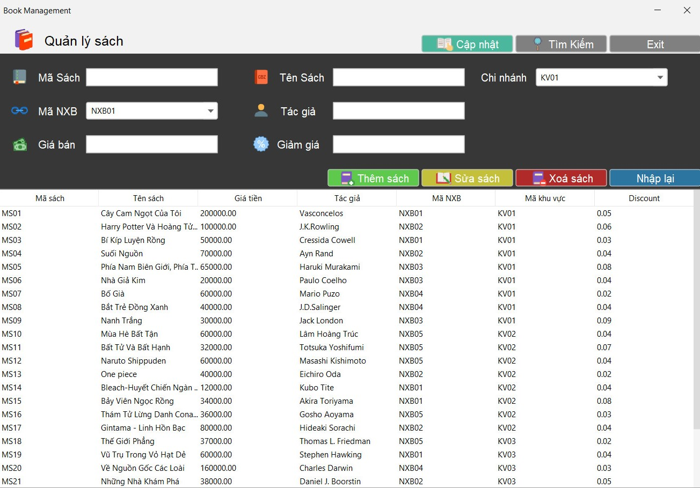
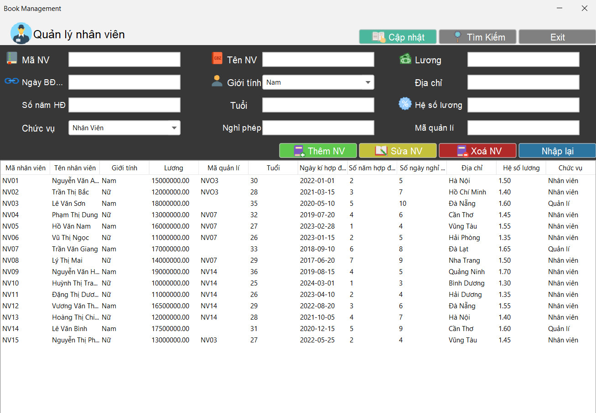
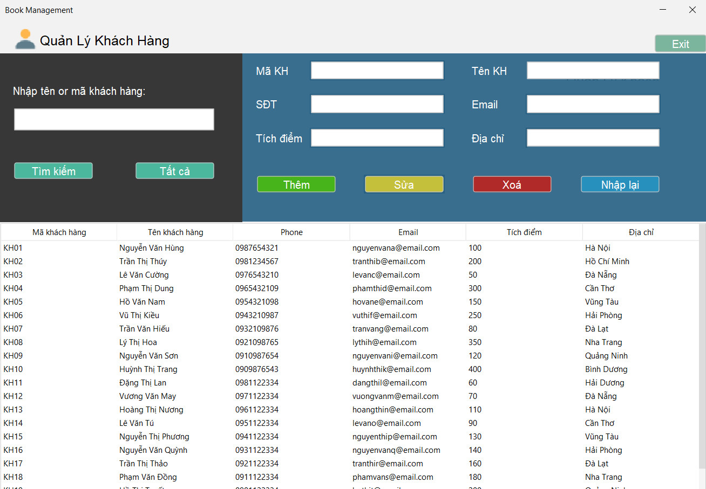
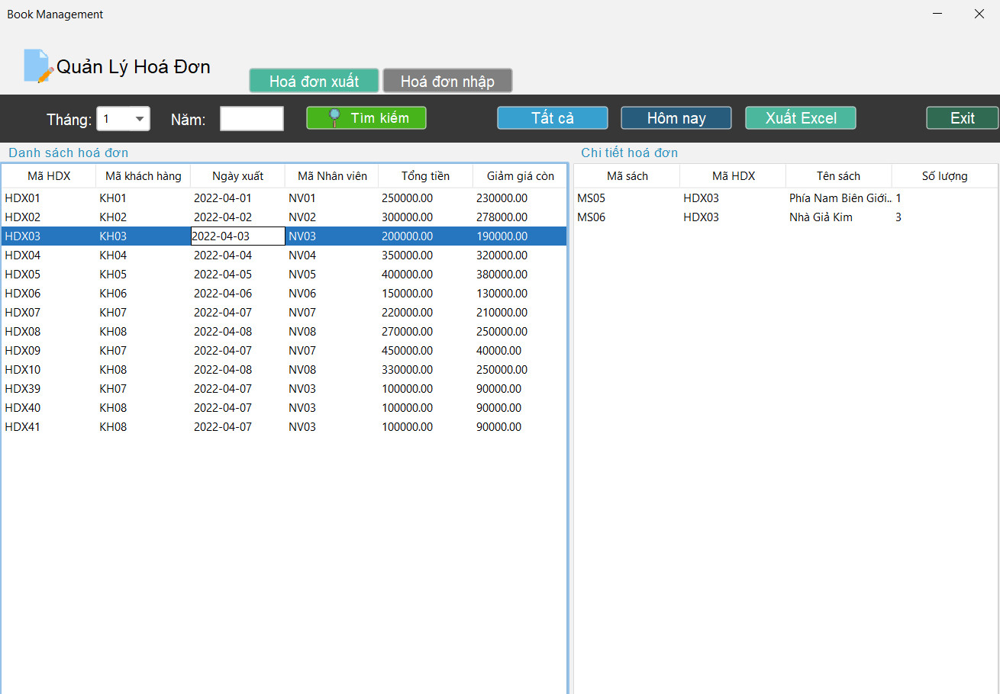
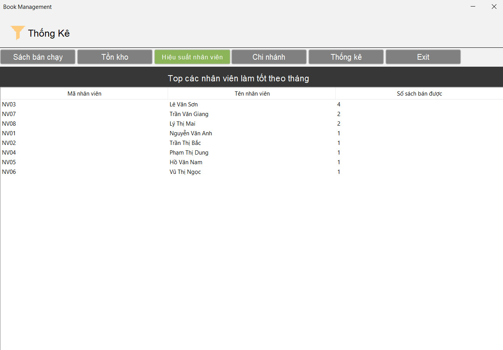
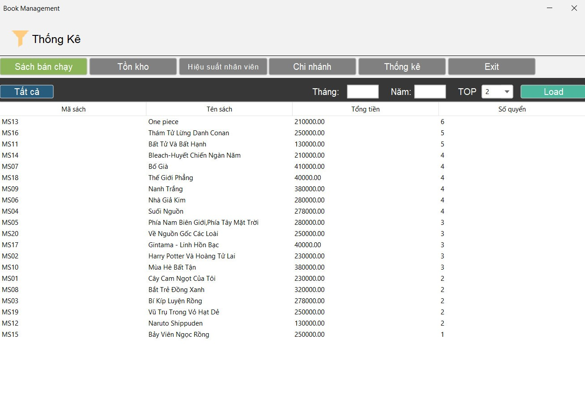

# Book Management System

The Book Management System is an intuitive application designed to streamline the management of books, staff, clients, and orders. It offers full CRUD functionality, making it easy to manage and track inventory for libraries or bookstores.

## Key Features
- **Add New Books**: Effortlessly add new books by entering details such as title, author, and publication year.
- **Edit Book Information**: Easily update book details including title, author, and publication year.
- **Delete Books**: Safely remove books from the system after confirmation to avoid accidental deletions.
- **View and Search Book List**: Access a detailed list of all books, with a convenient search function to quickly find specific titles.
- **Manage Staff, Clients, and Orders**: Perform similar CRUD operations for managing staff, clients, and orders efficiently.
- **Comprehensive Reports**: Generate insightful reports on key metrics such as bestselling books, inventory levels, employee performance, and branch performance.

## Technologies Used
- **Java Swing**: Delivers a rich graphical user interface for smooth and user-friendly interactions.
- **JDBC (Java Database Connectivity)**: Ensures seamless database operations, allowing for effective management of data across the system.

## Screenshots
- Book management:

- Staff management:

- Customer management:

- Orders management:

- Comprehensive Reports:



## How to run
- Clone the repository.
- Open the project in Visual Studio Code, IntelliJ, or any preferred IDE.
- Add [these libraries](resources/libs/) to the project.
- Build the project, create database using the provided script [here](resources/database/quanlibansach.sql).
- Change the server name, username, and password to match your SQL Server account in file [JDBCConnection](src/connect/JDBCConnection.java).
    ```java
    String url = "jdbc:sqlserver://server name:1433;databaseName=QUANLISACH;encrypt=true;trustServerCertificate=true;";
            Class.forName("com.microsoft.sqlserver.jdbc.SQLServerDriver");
            return (Connection) DriverManager.getConnection(url, "username", "password");
    ```
- Run the executable file to start the application.
## References
- [Java](https://www.javatpoint.com/java-tutorial)
- [Java Swing](https://www.javatpoint.com/java-swing)